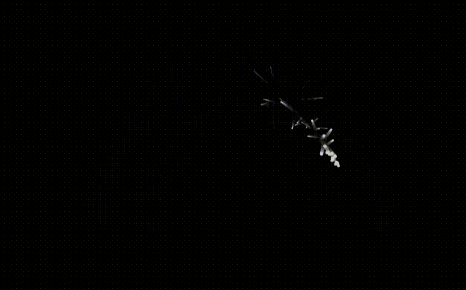
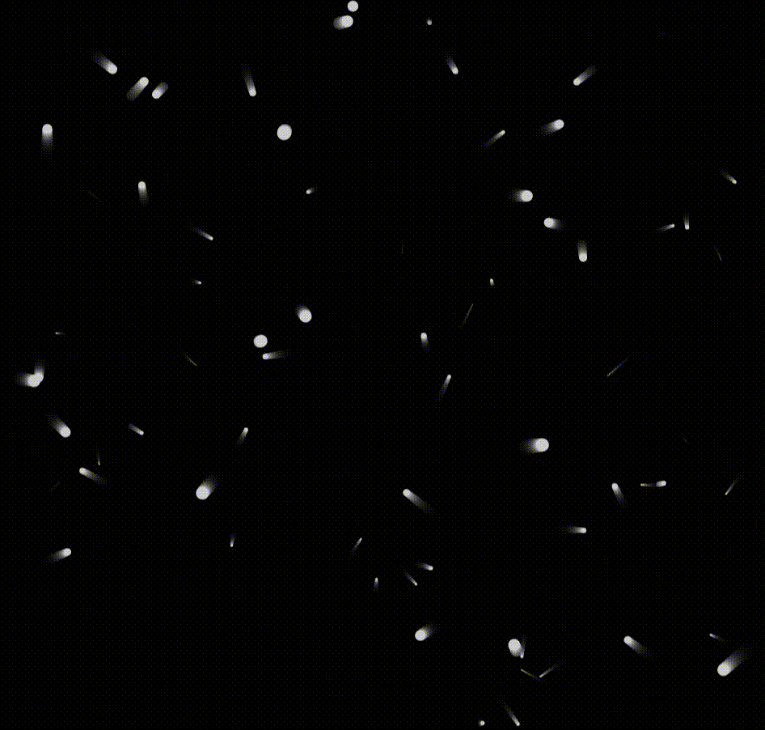

# Learning-Generative-Art

    
    

 

# Atom Animation Canvas

This is a simple interactive animation built using HTML5 Canvas and JavaScript. It creates a mesmerizing effect of particles (atoms) moving across the screen with dynamic colors and sizes.

## Table of Contents

- [Description](#description)
- [Features](#features)
- [Usage](#usage)

## Description

The Atom Animation Canvas project uses HTML5 Canvas and JavaScript to generate an interactive animation of moving atoms. The atoms are represented as small circles that move around the canvas, change in size, and create a visually pleasing effect. The animation is created using the `requestAnimationFrame` method, which provides smooth and efficient animation rendering.

## Features

- Interactive animation of atoms moving around the canvas.
- Atoms change their size and speed over time, creating a dynamic effect.
- The background features a gradient that adds to the visual appeal.
- Atoms are continuously generated, contributing to the animation's uniqueness.

## Usage

1. Clone the repository to your local machine.
2. Open the `index.html` file in a web browser that supports HTML5 Canvas and JavaScript.
3. Interact with the animation by moving your mouse over the canvas.

The animation starts automatically when you open the `index.html` file. As you move your mouse over the canvas, atoms will be generated and move towards the mouse cursor. The animation continues until you close the browser tab.

